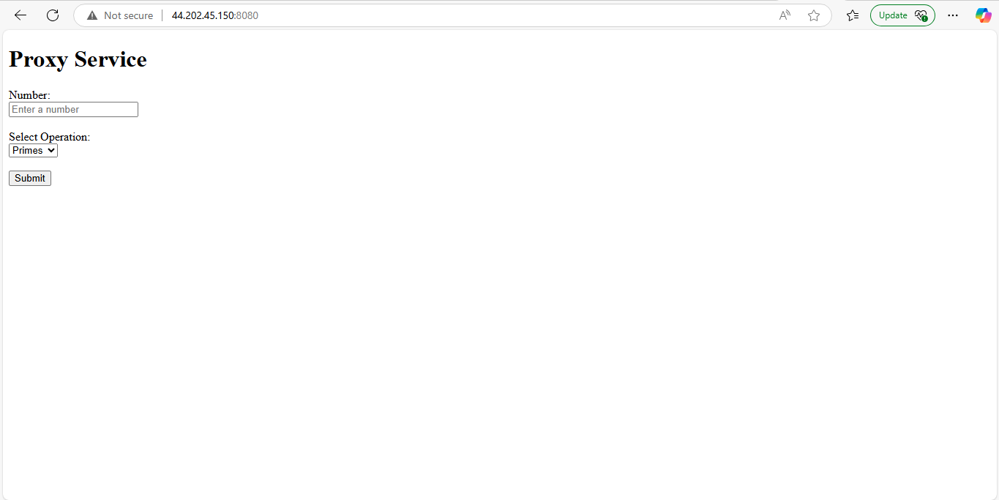

# ExamenT2_SGP

This project contains services and functionalities for mathematical operations. Below is a guide on how to access and use the services provided in the `mathServices`.

## Math Services

The `mathServices` folder contains two main services for mathematical operations. Follow the steps below to access and use them:


### 1. Obtaining the Source Code

1. Clone this repository into your local machine.
2. Go into the 3 directories in separate windows
3. Open a new terminal in said folders
4. Run the ```mvn clean install``` and the ```mvn clean package``` commands, a ```.jar``` file for each project should be generated 

### 2. Deploying On an AWS EC2 Instance
1. Create 3 new AWS EC2 Instances.
2. for each instance, open the port 8080 in the inbound rules edit page of the security group
3. connect to the instance
4. update and instal java on each instance.
5. send the .jar file from yoour local machine of each service to the instance using these commands: <br>
    ```scp -i examenkeys.pem MathFactorService/target/MathFactorService.jar ec2-user@EC2_IP_ADDRESS:/home/ec2-user``` <br>

    ```scp -i examenkeys.pem MathPrimeService/target/MathPrimeService.jar ec2-user@54.89.221.58:/home/ec2-user/``` <br>

    ```scp -i examenkeys.pem ProxyService/ProxyService/target/RESTProxyAPI.jar ec2-user@44.202.45.150:/home/ec2-user```


6. execute each jar file using a command like this: ```sudo java -jar FILENAME.jar```

### 3. Accessing the application

Access the app by typing the EC2 instance ip address in your browser, the select the operation and number:
